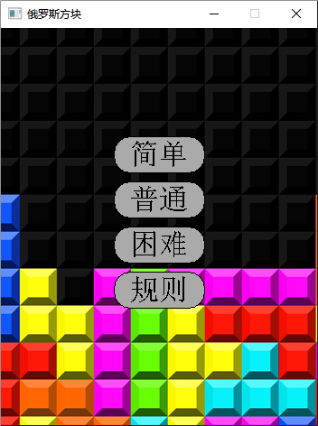
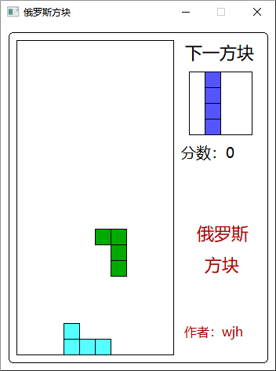

## 基于C++实现的俄罗斯方块小游戏
### 1. 项目简介
&emsp;&emsp;该项目是由C++语言编写的俄罗斯方块游戏，实现了基本的俄罗斯方块游戏功能，包括游戏难度选择，方块的下落，加速，旋转，消行，游戏结束等功能。

### 2. 环境依赖
&emsp;&emsp;该程序需要安装第三方图形库easyx.h,可以在[easyx官网](https://easyx.cn/)下载安装。目前该插件仅支持Visual Studio开发平台。

### 3. 游戏内容
开始界面：
 

游戏界面：

